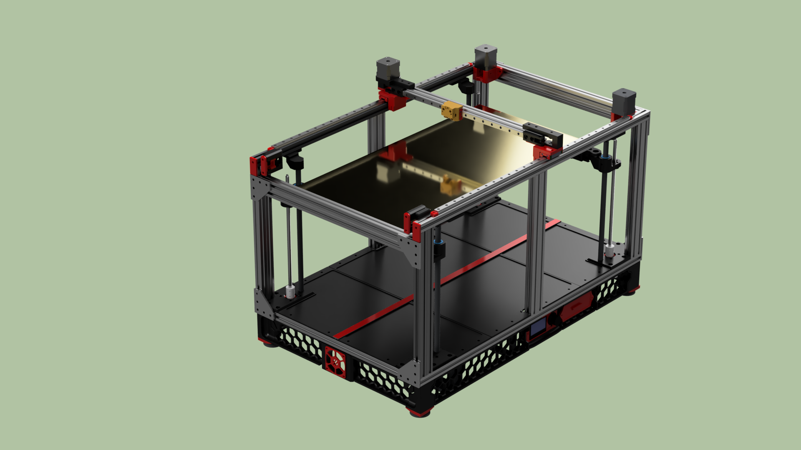

# The RIFF 600/900 3D printer

This is the home of the RIFF 600 and 900 large DIY 3D printers.
You'll find the Youtube build series here https://www.youtube.com/playlist?list=PLHk1C7nPAl80ZWU28OD7yWof3j6T3yG72  
You can also find the published STLs on: https://www.printables.com/model/1291703-the-riff-large-3d-printer

This is a 300x600 (RIFF 600) or 300x900 (RIFF 900) size DIY printer that can be built without spending a fortune. I encourage the use of second hand parts and will not provide any complete BOM listing specific new components. 

Some key information about my build:

Build plate 300 x 600 (assembly with 2 pcs 300x300 heat beds, 3 pcs in the 900) 
2020 and 2040 extrusions 
SKR 1.4 turbo and SKR Pico controllerboards 
Radxa Rock 3C SBC 
MGN 12H rails/carriage on Y and X. (350mm on X and 2x650 or 2x 950mm on Y)
12mm rods and bearings on Z 
Cartesian (the belts are a bit too long for corexy) 
Klipper firmware 
Dual Y steppermotors
Sensorless homing on X and Y 
Dragonburner with Sherpa micro 
2 x 360W 24V power supplies (3 x 360 24V in the 900 version)

Design and frame:

Cutting extrusions:

4x2020 775mm for Y (or 1075mm for the 900 version)
2x2020 450mm and 2x2040 450mm for X
6x2040 340mm for Z (or optionally 370mm)

Blind joints and corner plates plates:

Tap M5 holes in all 6 2040 Z extrusions (or minimum 4 of them as shown in the video)
Tap M5 holes in the top Y extrusion at least in one end. (The one facing the rear of the printer) 
Optional but recommended, tap Y-extrusions in both ends to provide for two extra sets of corner plates and a couple of cover plates
Drill access holes in all Y-extrusions to get to the button head screws in the Z-extrusions
Attach the front and rear corner plates. The front 2040 x extrusion should sit 40mm below the top of the Y-extrusion

Next step:

Check the frame for squareness and adjust/correct  as needed.
Mount the 4 z-motor mounts with M5 10mm bolts. The motor mounts makes the frame more rigid. Check the frame again for squareness.

--- Video part 2
Parts for the front and rear arms (heat bed sub assembly):

Front 1x366mm 2020 extrusion and 2x625 bearings

Rear 1x322mm 2020 extrusion

--- Video part 3
The 2020 extrusion for the x axis is 440mm

On my 600 build the 2020 extrusions for the bed assembly is 2 pcs 645mm. You have to check the bed mounts on your heat bed to determine if you need longer extrusions.
